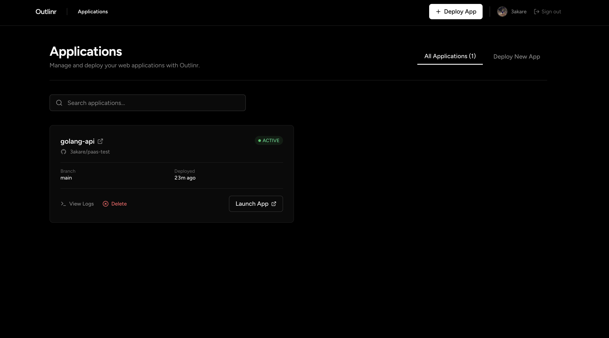

<div align="center">

# Outlinr

**Deploy your GitHub repositories instantly.**<br>
Outlinr is a lightweight, zero-configuration Platform as a Service (PaaS) that automatically builds your Docker containers and provisions live subdomains for your web applications with zero infrastructure headaches.


</div>



---

## Quick Start
Get your own private PaaS running locally in under 60 seconds.

```bash
# 1. Clone the repository
git clone https://github.com/3akare/outlinr-paas.git
cd outlinr-paas

# 2. Configure environment
cp .env.example .env

# 3. Spin up the cluster
docker compose up --build -d
```
Visit `http://localhost:5173` to connect your GitHub account and launch your first app.

---

## Contributing
We love community contributions! Whether it's fixing a bug, adding a new feature, or improving documentation, your help is appreciated. 
Please read our [Contributing Guide](CONTRIBUTING.md) to learn about our development process, how to propose bugfixes and improvements, and how to build and test your changes.

---

## Additional Information

### System Architecture
Outlinr uses a microservice-inspired architecture within a Spring Boot monolith, coordinating heavily with the Docker socket and Caddy to provide a seamless PaaS experience.

#### 1. Deployment Service (`DeploymentService`)
The entry point for applications. It handles the API lifecycle of a deployment:
- Validates repository access and checks for duplicate app names.
- Initializes database records for Apps, Environment Variables, and Deployments.
- Pushes a deployment payload to a Redis queue for asynchronous, non-blocking processing.

#### 2. Building Service (`BuildService` & `Buildkit`)
A background worker that polls Redis for queued deployments. When a job is picked up:
- It clones the user's GitHub repository to a local workspace (`/tmp/builds`).
- Connects to the `outlinr_paas_buildkitd` daemon via the Docker Java API to execute a BuildKit native image build.
- Packages the final Docker image as an optimized tarball (`/tmp/images`) while simultaneously streaming real-time build logs to the frontend via Server-Sent Events (SSE).

#### 3. Runtime Service (`RuntimeService`)
Responsible for infrastructure orchestration and container lifecycle management:
- Loads the built Docker image tarballs into the host Docker Daemon.
- Provisions new isolated Docker containers attached to the secure `outlinr-network` bridge.
- Injects user-defined environment variables and continuously polls container health status until the application is fully online (`ACTIVE`).
- Automatically handles teardown and garbage collection of superseded containers when a new deployment goes live.

#### 4. Routing Service (`CaddyService`)
Manages dynamic reverse proxying without requiring Nginx reloads:
- Integrates with Caddy's Admin API (`http://caddy:2019`) to dynamically add or remove routes.
- Maps `*.localhost` (or custom domains) directly to the isolated Docker containers (`outlinr-{deploymentId}:{appPort}`).
- Automatically handles SSL certificate provisioning (if configured for production domains).

#### 5. GitHub Integration Service (`GithubAppService`)
Handles secure communication between Outlinr and GitHub's ecosystem via a registered GitHub App:
- **OAuth Authentication**: Manages the user login flow, token exchanges, and stores secure session state.
- **Installation Flow**: When a user authorizes the Outlinr GitHub App, GitHub redirects back with an `installation_id`. This service securely binds the installation to the user's profile.
- **API Communication**: Generates short-lived JSON Web Tokens (JWT) signed with a private key to authenticate as the GitHub App. It uses these to fetch repository lists, validate permissions, check for `Dockerfile` presence, and securely clone code during the build phase.

### Core Features
- **Instant GitHub Deployments**: Select a repository and Outlinr builds and deploys it automatically.
- **Dynamic Subdomains**: Automatic routing to `*.localhost` (or your custom domain) powered by Caddy.
- **Live Build Logs**: Real-time deployment logs streamed directly to your browser.
- **Container Isolation**: Each app runs in its own securely sandboxed Docker container.
- **One-Click Teardown**: Completely remove an application and free up its resources with a single click.

### License
This project is licensed under the MIT License - see the [LICENSE](LICENSE) file for details.
